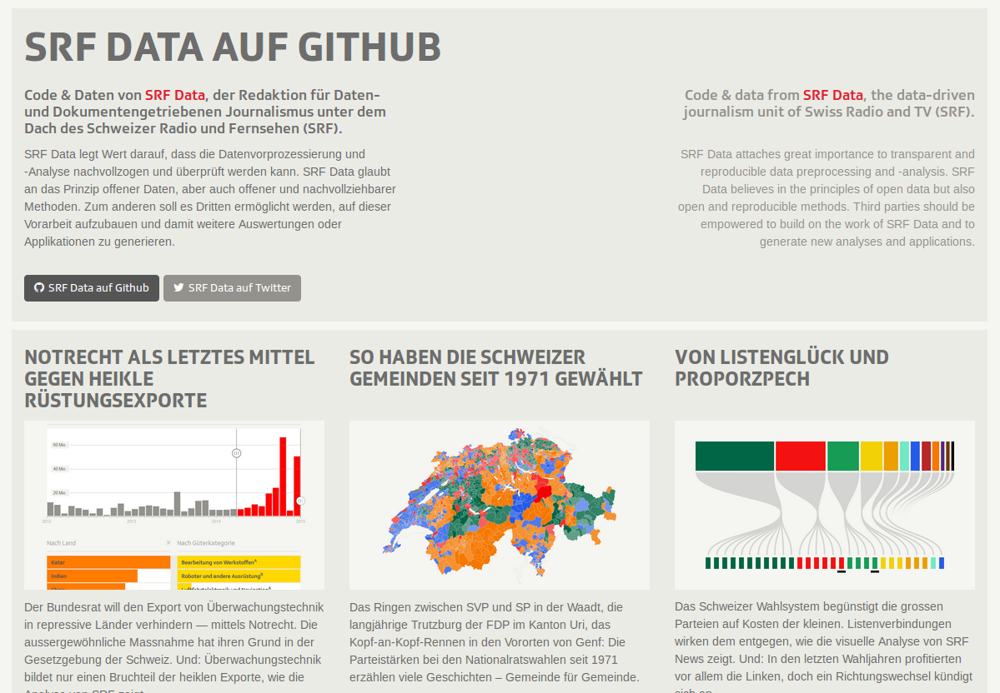
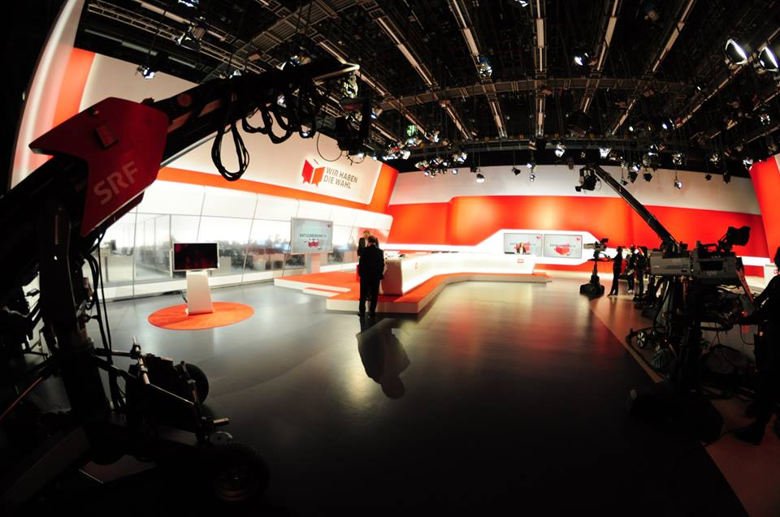

### Journalismustag '15
<h2>Transparenz und  Reproduzierbarkeit im #DDJ</h2>

### Warum und wie? 

Timo Grossenbacher, SRF Data

[@grssnbchr](http://twitter.com/grssnbchr)

[@srfdata](http://twitter.com/srfdata)

Präsentation vefügbar unter [grssnbchr.github.io/jt15-rddj](http://grssnbchr.github.io/jt15-rddj)

---

### Über mich

Ursprünglich: Studium Geographie & Informatik 

März - Oktober 2014: Tages-Anzeiger

Seit November 2014 beim Team von SRF Data als **Programmierer** und **Datenjournalist** 

[@grssnbchr](http://twitter.com/grssnbchr)

---

### SRF Data

[@srfdata](http://twitter.com/srfdata)

[Portfolio](http://srf.ch/data)

--- #slide-3-tweet

### Warum Transparenz?

<aside class="notes">Vor ein paar Wochen hat sich eine Schweizer Politikerin bei uns über ein neues Tool beschwert. In diesem Fall war der Vorwurf der Pseudoobjektivität völlig unbegründet - einen wunden Punkt des Datenjournalismus trifft die Dame mit dem Vorwurf jedoch trotzdem.</aside>

Deswegen: 

<blockquote class="twitter-tweet" data-conversation="none" data-cards="hidden" data-partner="tweetdeck">
<a href="https://twitter.com/brenntr">@brenntr</a> <a href="https://twitter.com/fljan">@fljan</a> <a href="https://twitter.com/srfdata">@srfdata</a> <a href="https://twitter.com/srfnews">@srfnews</a> sag ich doch, das mit dem Datenjournalismus ist eine heikle Sache und mündet zu oft in Pseudoobjektivität
&mdash; Jacqueline Badran (@JayBadran) <a href="https://twitter.com/JayBadran/status/613021865007820800">June 22, 2015</a></blockquote>

--- 

### Warum Transparenz?

<aside class="notes">Datenjournalistische Arbeit kann nur selten ausführlich erklärt werden - schon gar nicht in einem (Zeitungs-)Artikel. Während man bei klassischen Recherchen schnell mal erklären kann, dass man z.B. eine wichtige Info in einer Gerichtsakte gefunden hat, ist es beim DDJ schwieriger.
Datenjournalisten wissen, dass die Resultate ihrer Arbeit nicht per se objektiver ist als die von anderen Journalisten. Sie sollten sich aber auch bewusst sein, dass beliebig komplexe Auswertungen Gefahr laufen, ihre Objektivität ganz zu verlieren. Nämlich dann, wenn unüberlegt und ungerechtfertigt Entscheidungen getroffen werden, die das Resultat einer Analyse stark verändern könn(t)en. Wenn man diese Schritte nicht transparent macht, dann besteht in der Tat die Gefahr der Pseudoobjektivität. Mit der Offenlegung unserer Methoden machen wir uns zwar angreifbar, aber wir können uns auch besser rechtfertigen. Im Idealfall weisen uns Leser konstruktiv auf Fehler hin, die wir beim nächsten Mal vermeiden können.</aside>

Das **Problem**: Datenjournalistische Arbeit kann nur selten ausführlich erklärt werden

.fragment Jeder zusätzliche Prozessierungsschritt bedingt neue *Entscheidungen*  – Gefahr der **"Pseudo-Objektivität"** steigt

.fragment Interessierte sollten die Chance erhalten, uns zu hinterfragen *und* uns zu korrigieren

---

### Stufen der Transparenz

<aside class="notes">Transparenz kann man verschiedentlich auslegen, ich habe einmal versucht, eine Abstufung zu machen. Jede Stufe bedingt mehr oder weniger die vorhergehenden Stufen.</aside>

.fragment 1. Quellenangaben (leider nicht selbstverständlich...)

.fragment 2. Beschreibung und Rechtfertigung der Methoden, z.B. mit einem [Werkstattbericht](http://www.digitalerwandel.de/2013/04/23/wir-bauen-uns-eine-nachrichtenquelle-werkstattbericht-zum-flugrouten-radar/)

.fragment 3. Offenlegung der Rohdaten und prozessierten Daten (z.B. wie bei [fivethirtyeight.com](https://github.com/fivethirtyeight/data))

.fragment 4. Offenlegung der Methoden, volle *Reproduzierbarkeit* (z.B. wie bei der [NPR Military Gear Story](http://blog.apps.npr.org/2014/09/02/reusable-data-processing.html))

--- 

### Reproduzierbarkeit?

<aside class="notes">Ohne Reproduzierbarkeit keine echte, vollständige Transparenz. Richtige Reproduzierbarkeit bedingt, dass von den absoluten Rohdaten bis zum (analytischen) Endergebnis alle Schritte nachvollziehbar und ausführbar sind. Eigentlich ist dies nur zu erreichen, wenn man die Schritte "aufzeichnet", und dafür eignet sich am besten Code: Sprich, die Datenanalyse selber besteht aus einem Skript, dass einen Input nimmt und einen Output generiert. Das bringt zwei Vorteile mit sich: Man kann das Skript wiederverwenden, z.B. bei neuen Daten. Und das ganze ist automatisiert, sprich, wir können Kaffee trinken gehen, während der Computer rechnet. Die Automatisierung kann wiederum dabei helfen, Fehler zu vermeiden, die man beim manuellen Bearbeiten, z.B. bei Unkonzentriertheit, machen könnte.</aside>

.fragment ... von einem bestimmten Input immer zum gleichen Output gelangen

.fragment ... alles nachvollziehen können

.fragment ... darauf aufbauen können

.fragment **Nebeneffekte**:

.fragment 1. Transparenz

.fragment 2. Wiederverwendbarkeit / Automatisierung 

.fragment 2b. Reduzierte Fehleranfälligkeit

--- 

### Genug der Theorie!!! 

<aside class="notes">Im folgenden nun zwei Beispiele, wie wir bei SRF Data konkret versuchen, das zu leben, was ich hier predige.</aside>

<small>Bildquelle: Flickr.com</small>

---

### Wie wir versuchen, transparent zu sein

<aside class="notes">Im selben Zug möchte ich zwei Tools bzw. Ideen präsentieren, wie man mit Technologie Transparenz schaffen kann.</aside>

(und effizient zu arbeiten...)

[R](http://r-project.org) / [RMarkdown](http://rmarkdown.rstudio.com/)

[GitHub](http://github.com)

---

### Transparenz & Open Data

[SRF Data auf GitHub](http://srfdata.github.io)

--- 

### Eidgenössische Wahlen 2015

---

### Demo

---

### Fazit

**R** ermöglicht uns:

* alle Prozessierungsschritte an einem Ort zu *bündeln*
    * einlesen
    * vorprozessieren
    * auswerten
    * visualisieren
    * vorbereiten / transformieren
    * ...
    * (Twitter / interaktive Grafiken & Karten / ...)
 
* Beschreibung der Daten und Methoden mit **Markdown**

* Publikation der Daten und Methoden auf **[GitHub / GitHubPages](http://srfdata.github.io)**

---

## Lust auf mehr?

[rddj.info - damit bringt Ihr Euch R bei](http://rddj.info)

[grssnbchr/rddj-reproducibility-workflow](https://github.com/grssnbchr/rddj-reproducibility-workflow)

Gute Lektüre: [Brian Keegan calls out 538 for openness in #ddj](http://www.brianckeegan.com/2014/04/the-need-for-openness-in-data-journalism/)

---

# Danke

## Fragen? 

[@grssnbchr](http://twitter.com/grssnbchr)

[@srfdata](http://twitter.com/srfdata)

Diese Präsentation ist verfügbar (und reproduzierbar) unter [github.com/grssnbchr/jt15-rddj](https://github.com/grssnbchr/jt15-rddj/blob/gh-pages/index.md)

<small>Gebaut mit [slidify](https://github.com/ramnathv/slidify) und [revealjs](https://github.com/hakimel/reveal.js/)</small>
